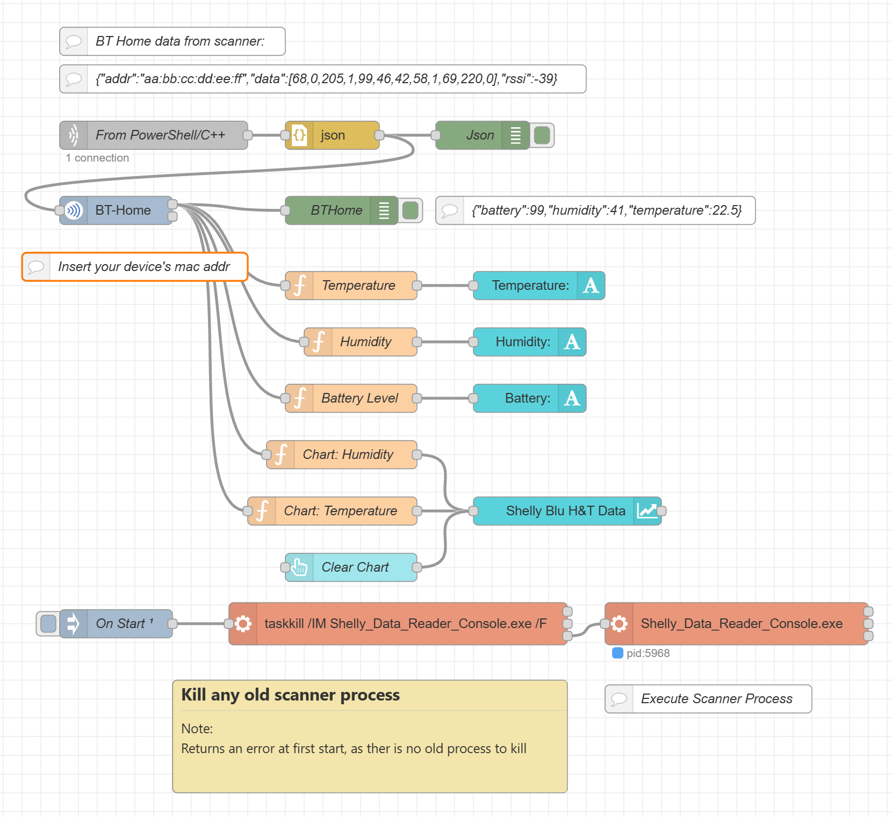

# BT-Home-Scanner-for-Nodered (Windows only)
A Nodered/C++ project for Windows: Scanning for BTHome (Shelly) sensors.

Demonstrates:
- Node-red basics
- The Node-red dashboard with a basic line chart
- C++ console application with Ble scanner and TCP

Included:
Example Node-red flow
A lightweight Windows console application that scans for **Bluetooth Low Energy (BLE)** advertisements in the [BTHome](https://bthome.io/) format, and streams the decoded data to **Node-RED** over TCP in real time.



## Features of the C++ executable
- Built as a replacement for the older, unmaintained BLE scanning nodes available in Node-RED.
- Passive BLE scanning — no pairing or connection required
- Filters on the BTHome service UUID (`0xFCD2`) so only relevant devices are processed
- Sends compact JSON messages over a persistent TCP socket
- De-duplicates repeated advertisements — only transmits when service data actually changes
- Optional command-line arguments for host and port

## JSON Output Format

Each message is a single line of JSON terminated by `\n`:

```json
{"addr":"aa:bb:cc:dd:ee:ff","data":[68,0,93,1,99,46,43,58,1,69,237,0],"rssi":-41}
```

| Field  | Type       | Description                                                        |
|--------|------------|--------------------------------------------------------------------|
| `addr` | `string`   | MAC address of the advertising device                              |
| `data` | `number[]` | Service data bytes (BTHome payload, `D2 FC` header stripped)       |
| `rssi` | `number`   | Received signal strength in dBm                                    |

## Requirements

| Requirement            | Minimum                            |
|------------------------|------------------------------------|
| OS                     | Windows 10 or later                |
| Bluetooth adapter      | Bluetooth 4.0 (BLE) or later       |
| Build tools            | Visual Studio 2022 with C++ desktop workload |
| C++ standard           | C++20                              |
| Windows SDK            | 10.0                               |

## Building

1. Create a C++ console application in Visual Studio- name it "Shelly_Data_Reader_Console"
2. Paste the supplied C++ code into the .cpp file
3. Select the **Release | x64** configuration.
4. Build the solution (**Ctrl+Shift+B**).
5. Copy the executable to the .node-red folder (The executable is written to `x64\Release\Shelly_Data_Reader_Console.exe`)

## Usage (not necessary as the example Node-red flow starts the scanner at startup or deploy)
> **Tip:** The supplied Node-RED example flow expects the compiled executable to be placed in the `.node-red` folder.

```
Shelly_Data_Reader_Console.exe [host] [port]
```

| Argument | Default       | Description                          |
|----------|---------------|--------------------------------------|
| `host`   | `127.0.0.1`  | IP address of the Node-RED instance  |
| `port`   | `5000`       | TCP port to connect to               |

## Node-RED Setup

1. Add a **tcp in** node and configure it to **Listen on** port `5000` (or your chosen port), with output set to **String** and delimiter `\n`.
2. Connect it to a **json** node to parse the incoming messages into JavaScript objects.
3. Process the `msg.payload` object (containing `addr`, `data`, and `rssi`) as needed in your flow.

Or import the supplied file: flows.json into Node-red
These nodes need to be in the Node-red pallette:
- flowfuse/node-red-dashboard
- mschaeffler/node-red-bthome
- node-red-contrib-markdown-note

## How It Works

1. The application initialises a `BluetoothLEAdvertisementWatcher` (C++/WinRT) in **passive** scanning mode.
2. Every received advertisement is checked for a **Service Data** section (AD type `0x16`) starting with the BTHome UUID bytes `D2 FC`.
3. If the service data has changed since the last advertisement from that device, a JSON message is built and sent over the TCP socket to Node-red.

## License

This project is provided as-is for personal and educational use.
